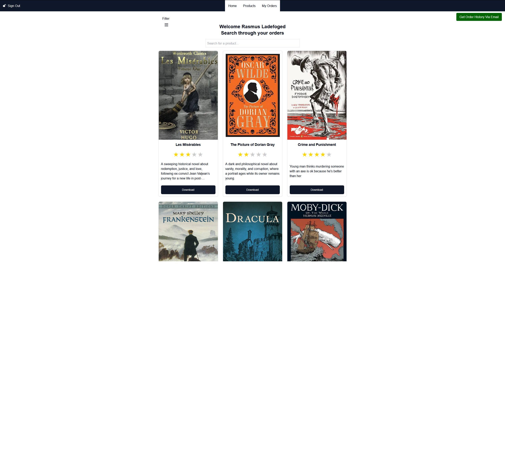

# Rasmus Ladefoged - Software developer from Copenhagen, Denmark

I am a Software Developer with 5 years of experience in IT from Ireland and a degree in Computer Science from Copenhagen University.

I love problem-solving and learning new skills. Currently, I am focusing on full-stack development by building a Next.js Webshop for books, incorporating features like secure payments, dynamic routing, secure sign-in, automated emails, product search, database hosting and many more things. It is still under development and continually updated.

Alongside web development, I'm working on a 2D Dungeon Crawler Game, enhancing my algorithmic thinking and ability to write clean, scalable and maintainable code. From building the game engine to implementing features like AI, combat, and interactable environments, this project has significantly sharpened my problem-solving skills.

Below are some of my notable projects and the technologies I’ve used to build these projects:

---
# Websites:
**[Interactive Book Store!](https://booky-mu.vercel.app/)**  
**[Portfolio Website!](https://rasmuslc1.github.io/portfolio_website/#)**  

#
## 🧰 Languages and Tools

 

#

# Interesting Projects

## 💻 **[Bookstore Webshop](https://github.com/RasmusLC1/Booky)**  

A full-stack web application for buying, uploading, searching, and managing books, built with Next.js. The platform offers a seamless user experience through secure payments, user accounts, automated emails, dynamic routing, and more.

### Link
https://booky-mu.vercel.app/

### Features
- 👤 **User Accounts** with profile pages and order history
- 💳 **Secure Payment Processing** using the **Stripe API**
- 🔒 **Secure Sign-In** and authorization with **Next-Auth** and **bcrypt** for encryption
- 🔐 **Password Reset Emails** with secure, time-limited dynamic links and encrypted password updates via the **Resend API**
- 📧 **Automated Emails** for account actions and order details via the **Resend API**
- 📂 **Secure File Uploads** via the **EdgeStore API** with validation filters to prevent malicious content
- 🗄️ **Database Integration** with Prisma ORM and SQLite for efficient backend storage
- 👩‍💻 **HTML Sanitization** to prevent XSS attacks and ensure safe user input when creating their account and adding recipes
- 🔗 **Dynamic URL Routing** with randomized product IDs to enhance security
- 👮‍♀️ **Admin Dashboard** for managing users, products, and orders, handling user feedback, and moderating reported products
- 🔍 **Product search** and filtering
- ☁ **Database Hosting** using **Supabase** for scalable and reliable backend services
- 🌐 **Website Hosting** using **Vercel** for fast, secure, and continuous deployment.

### Technology
- **Language:** TypeScript
- **Frontend:** React, Next.js
- **Backend:** Node.js, NextAuth
- **Database:** Supabase (via Prisma ORM)
- **APIs:** Stripe, Resend, EdgeStore
- **Security:** HTML Sanitization, bcrypt, Zod
- **Hosting**: Vercel

### Goal
Booky is a full-stack bookstore platform that enables users to upload, manage, and self-publish their books securely and efficiently. The platform offers a user-friendly solution for organizing and sharing books, with robust features for both end-users and administrators.
#

## 🕹 **[Dungeon Crawler Game](https://github.com/RasmusLC1/Dungeon-Crawler)**  

This project showcases a custom-built game engine powering a procedurally generated 2D dungeon crawler featuring real-time AI, dynamic lighting, and interactive gameplay mechanics.

### Features
- 🧠 Advanced Enemy AI optimized to handle hundreds of enemies simultaneously using A* for pathfinding and Spatial Hash Grid for fast lookups. The AI dynamically scales its decision-making by checking fewer parameters when enemies are far from the player, minimizing computational overhead.
- 🏰 Procedural Dungeon Generation using cellular automata and custom rulesets
- 🗺️ Spatial Hash Grid for efficient collision detection and entity lookups
- 🌟 Real-Time Dynamic Lighting that updates as the player explores the dungeon
- 🎮 State manager to handle game events
- 🎒 Interactive Inventory System for managing loot, equipment, and consumables
- ⚔️ Combat and Magic System with state-driven effects and animations

### Technology
- Language: Python
- Algorithms: A*, Spatial Hash Grid, Custom Lighting Algorithm, Cellular Automata, Raycasting

### Performance Metrics
- Stable 60 fps
- Optimized for 100+ enemies without noticeable performance degradation
- Map size is limited to 120 X 120 for gameplay, but can be increased to 500X500 without performance decrease
- There are no known game breaking bugs or unexpected crashes
  
#

## 🧮 **[Bachelor Project in Polynomial Multiplication](https://github.com/RasmusLC1/Polynomial-Multiplication)**  

Research into the effectiveness of efficient algorithmic implementation with focus on polynomial multiplication

### Features
- 📈 Karatsuba's algorithm implemented for polynomial multiplication and optimised for 14 X improved performance
- 🔄 Recursive FFT algorithm implemented
- 🔁 Iterative FFT algorithm implemented for 2.5 X improved performance
- 🧪 Extensive Unit testing for correctness and performance

#

## 🕹 **[3D Wolfenstein Renderer](https://github.com/RasmusLC1/Wolfenstein-Renderer)**  

A 3D renderer built in C# using .NET, inspired by the original Wolfenstein 3D game.

### Features
- 👁 3D view of a 2D map
- 💡 Lighting engine to simulate depth
- 🧠 Enemy AI that pathfinds to and targets the player
- 🗺️ 2D perspective of the map with raycaster for field of view
- 🕹 Early demo for the Dungeon Crawler game I later wrote in Python

### Technology
- Language: C#

