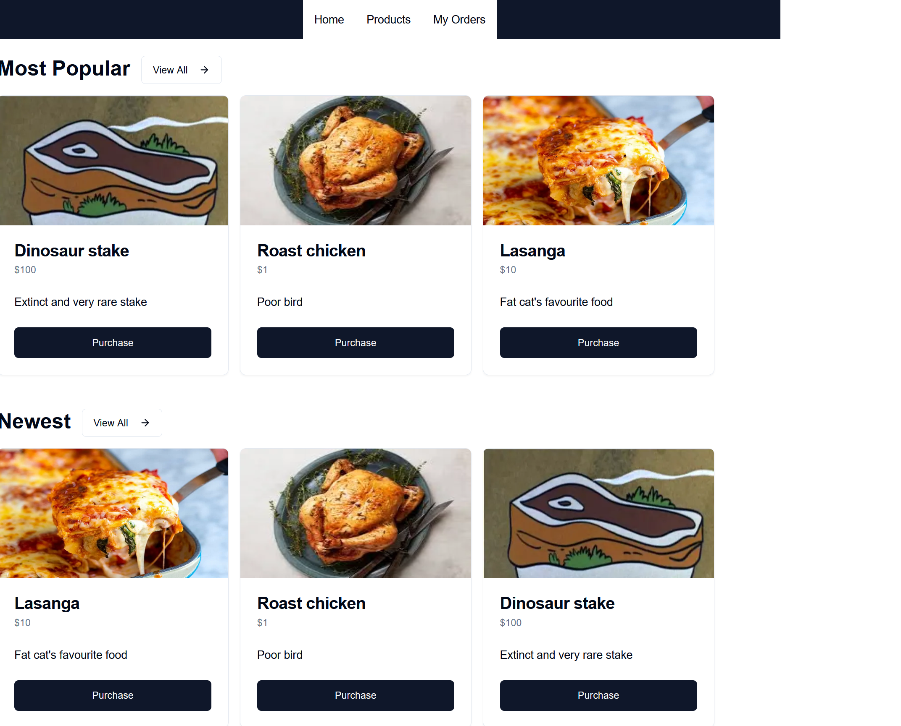
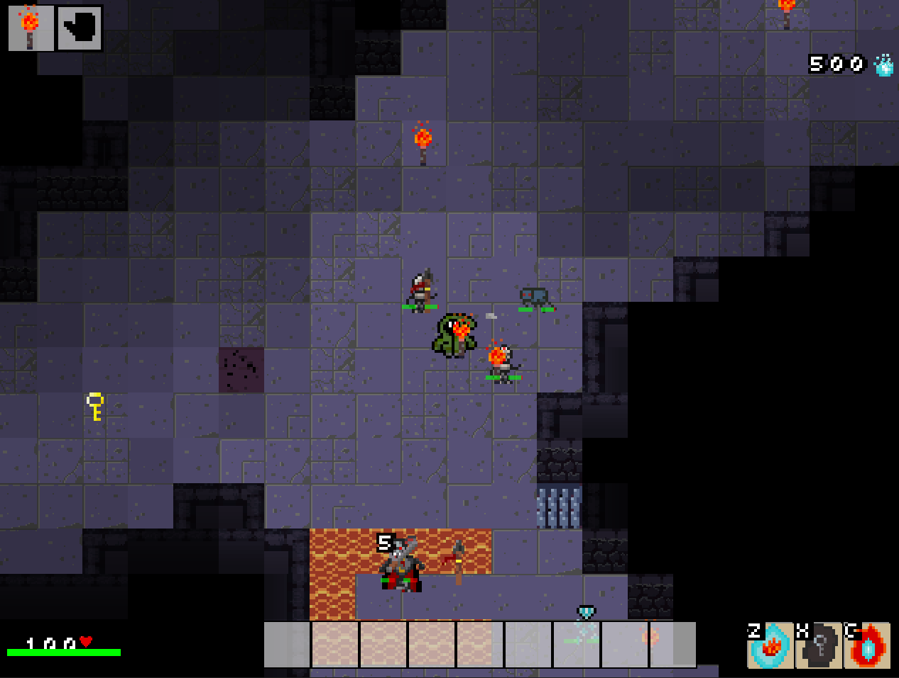
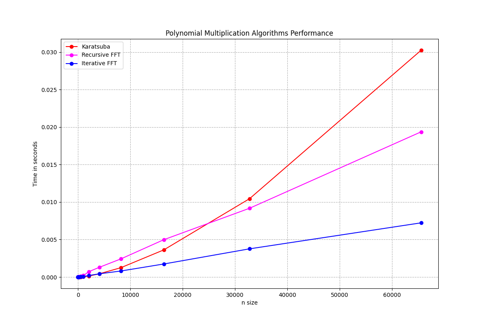
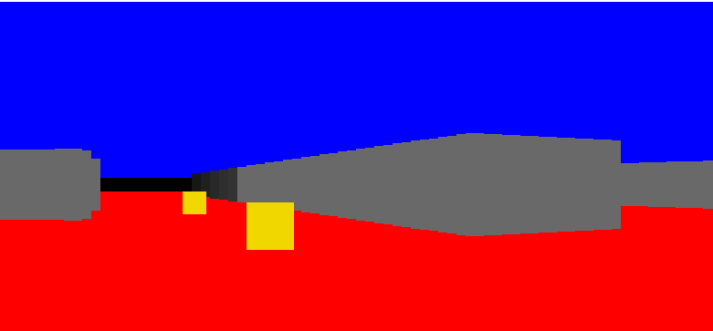

# Rasmus ladefoged - Software developer from Copenhagen, Denmark

Software developer with 5 years of experience in IT and a degree in Computer Science from Copenhagen University.

I enjoy problem solving and learning new skills. I am improving my skills in full stack development by building a Next.js Webshop for recipes. I am also working on improving my programming skills through my Dungeon Crawler Game which has helped me develop my problem solving skills and writing better and more maintainable code.

Below you can see some of my projects and the technologies used to build them:

---
# Portfolio Website:
**[Check out my portfolio website!](https://rasmuslc1.github.io/portfolio_website/#)**  

#
## 🧰 Languages and Tools

 

#

# Interesting Projects

### **[Recipe App](https://github.com/RasmusLC1/Recipe-App)**  

A full-stack web application for uploading, searching, and managing recipes, built with Next.js. The app delivers a seamless user experience by integrating secure payment, automated emails, and dynamic routing.

### Features
- 👤 User Accounts with profile pages and order history
- 💳 Secure Payment Processing using the Stripe API
- 📧 Automated Emails for account actions and order details via the Resend API
- 🗄️ Database Integration with Prisma ORM and SQLite for efficient backend storage
- 🔗 Dynamic URL Routing with randomized product IDs to enhance security
- 👮‍♀️ Admin Dashboard for managing users, products, and orders

### Technology
- Language: TypeScript
- Libraries: React, Next.js,  Node.js 
- Database: SQLite (via Prisma ORM)
- APIs: Stripe, Resend

#

## **[Dungeon Crawler Game](https://github.com/RasmusLC1/Dungeon-Crawler)**  

This project showcases a custom-built game engine powering a procedurally generated 2D dungeon crawler featuring real-time AI, dynamic lighting, and interactive gameplay mechanics.

### Features
- 🧠 Advanced Enemy AI with optimizations to handle hundreds of enemies simultaneously
- 🏰 Procedural Dungeon Generation using cellular automata and custom rulesets
- 🗺️  Spatial Hash Grid for efficient collision detection and entity lookups
- 🌟 Real-Time Dynamic Lighting that updates as the player explores the dungeon
- 🎮 State manager to handle game events
- 🎒 Interactive Inventory System for managing loot, equipment, and consumables
- ⚔️ Combat and Magic System with state-driven effects and animations

### Technology
- Language: Python
- Algorithms: A*, Spatial Hash Grid, Custom Lighting Algorithm, Cellular Automata, Raycasting

### Performance Metrics
- Stable 60 fps
- Currently supports up to 100 enemies without noticable performance decrease
- Map size is limited to 120 X 120 for gameplay, but can be increased to 500X500 without performance decrease
- There are no known game breaking bugs or unexpected crashes

#

## **[Bachelor Project in Polynomial Multiplication](https://github.com/RasmusLC1/Polynomial-Multiplication)**  

Research into the effectiveness of efficient algorithmic implementation with focus on polynomial multiplication

### Features
- 📈 Karatsuba's algorithm implemented for polynomial multiplication and optimised for 14 X improved performance
- 🔄 Recursive FFT algorithm implemented
- 🔁 Iterative FFT algorithm implemented for 2.5 X improved performance
- 🧪 Extensive Unit testing for correctness and performance

#

## **[3D Wolfenstein Renderer](https://github.com/RasmusLC1/Wolfenstein-Renderer)**  

A 3D renderer built in C# using .NET, inspired by the original Wolfenstein 3D game.

### Features
- 👁 3D view of a 2D map
- 💡 Lighting engine to simulate depth
- 🧠 Enemy AI that pathfinds to and targets the player
- 🗺️ 2D perspective of the map with raycaster for field of view
- 🕹 Early demo for the Dungeon Crawler game I later wrote in Python

### Technology
- Language: C#

# Contact
Currently open to job offers, feel free to reach out if my skillset is of interest.

Email: rasmus.lc3@gmail.com

