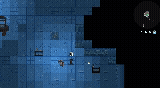
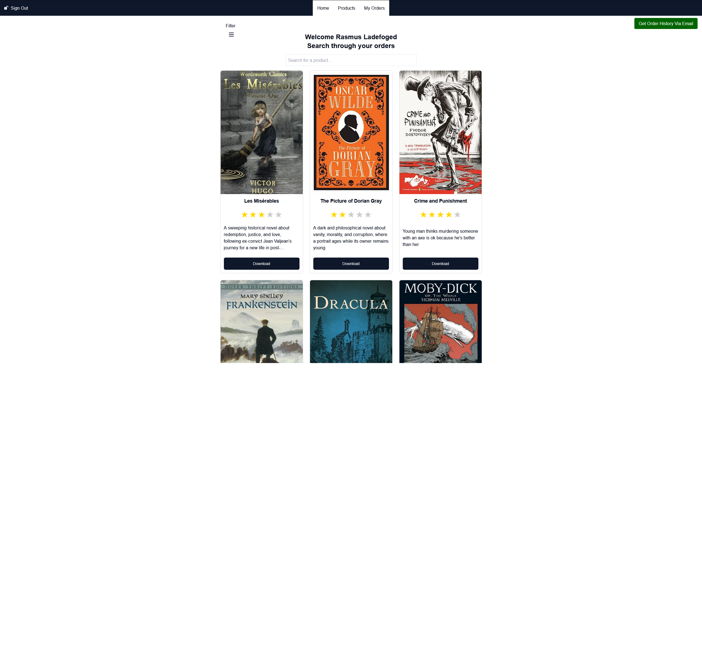
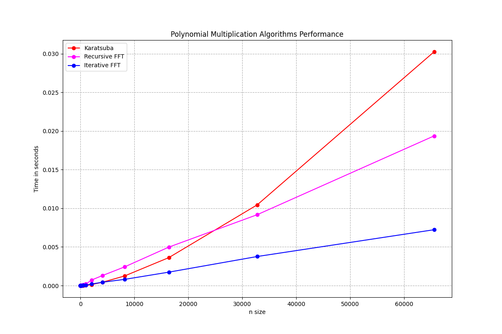
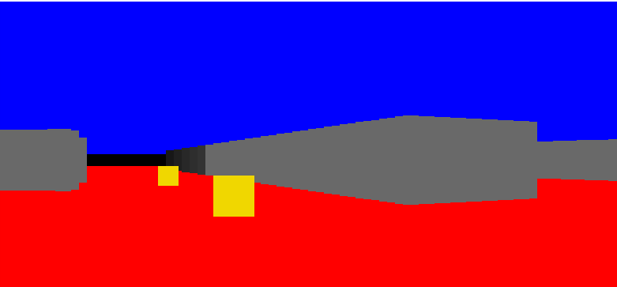

# Rasmus Ladefoged — Software Developer from Copenhagen, Denmark

I am a Software Developer with a Computer Science degree from Copenhagen University, a year of commercial development experience at Netcompany, and 5 years of professional enterprise IT experience in Ireland, where I worked with:
* **QA testing** for Google
* **Systems infrastructure** for Microsoft
* **Enterprise support** for Apple

I thrive on solving complex architectural problems, optimizing performance, and building clean, maintainable systems. Currently, my engineering focus is split between modern full-stack web architectures and performance-critical systems development.

### 🚀 Current Focus Areas

* **Systems & Algorithmic Thinking:** Developing a complex **2D Dungeon Crawler** from scratch in Python. Rather than relying on a commercial engine, I am building the core mechanics myself—focusing on advanced AI pathfinding, real-time raycasting, and custom spatial partitioning to optimize performance under heavy entity loads.
* **Architecture & Maintainability:** Practicing rigorous software engineering patterns to manage a large-scale codebase as complexity scales. The engine leverages **Component Composition** over deep inheritance hierarchies, separating game state, rendering logic, and physical boundaries into decoupled subsystems. By utilizing patterns like **Data-Driven Factories** for entity spawning and **Lazy Instantiation** for resource management, the architecture minimizes memory overhead and remains highly extensible as new mechanics are introduced.

Below are some of my notable projects, followed by the toolset I use to build them.

---

### ⚔️ **[Custom 2D Dungeon Crawler Engine (Kobold Clash)](https://github.com/RasmusLC1/Kobold_Clash/)** — *Python, Pygame*

A custom-built game engine powering a procedurally generated 2D world with real-time AI, dynamic lighting, and zero external engine dependencies.
* **Load-Balanced AI:** Supports 100+ simultaneous enemies utilizing $A^*$ pathfinding coupled with a frame-distributed request queue to eliminate frame stuttering while maintaining 60+ FPS.
* **Spatial Knowledge Hub:** Designed a centralized tile grid system where tiles cache local boundaries and entities, dropping situational queries down to $O(1)$ complexity.
* **Dynamic AI Director:** Features a systemic difficulty engine ("The Awakening") that monitors player noise and environmental density to dynamically manipulate spawns and traps.
* **Raycasting & Lighting:** Implements a 360° raycasting system for fog-of-war exploration with additive per-source tile lighting, pre-computed ray vectors, and cached tile surfaces to minimise redraws.
* **Automated Testing:** Backed by a pytest suite covering core engine systems including AI pathfinding, tilemap spatial queries, raycasting, status effect interactions, and procedural generation pipelines, using mock architectures to isolate components without requiring a live game instance.
* **Developer Note:** Active development since August 2024 — the git history reflects two years of continuous architectural improvement. Newer systems (enemy AI, lighting, tiles, effects) represent my current design thinking; older systems (inventory, weapons) are due for refactoring and show where the project started.

---
### ⚔️ **[Custom 2D Dungeon Crawler Engine (Kobold Clash)](https://github.com/RasmusLC1/Kobold_Clash/)** — *Python, Pygame*

A custom-built game engine powering a procedurally generated 2D world with real-time AI, dynamic lighting, and zero external engine dependencies.
* **Load-Balanced AI:** Supports 100+ simultaneous enemies utilizing $A^*$ pathfinding coupled with a frame-distributed request queue to eliminate frame stuttering while maintaining 60+ FPS.
* **Spatial Knowledge Hub:** Designed a centralized tile grid system where tiles cache local boundaries and entities, dropping situational queries down to $O(1)$ complexity.
* **Dynamic AI Director:** Features a systemic difficulty engine ("The Awakening") that monitors player noise and environmental density to dynamically manipulate spawns and traps.
* **Raycasting & Lighting:** Implements a 360° raycasting system for fog-of-war exploration with additive per-source tile lighting, pre-computed ray vectors, and cached tile surfaces to minimise redraws.
* **Automated Testing:** Backed by a pytest suite covering core engine systems including AI pathfinding, tilemap spatial queries, raycasting, status effect interactions, and procedural generation pipelines, using mock architectures to isolate components without requiring a live game instance.
* **Developer Note:** Active development since August 2024 — the git history reflects two years of continuous architectural improvement. Newer systems (enemy AI, lighting, tiles, effects) represent my current design thinking; older systems (inventory, weapons) are due for refactoring and show where the project started.

---
### 🏝️ **[Procedural Town Simulator (Towns-End)](https://github.com/RasmusLC1/townsend/)** — *Godot 4, C#*

A procedurally generated 3D island town-builder built on Godot's GridMap, combining custom terrain generation, coastline-aware biome placement, and a fully decoupled tool-based editing system.
* **Procedural Terrain Generation:** Layered simplex noise combined with a radial falloff mask carves a bounded island silhouette; a dual-cache system (full-column data for cliffs/caves, a dedicated surface-tile index for everything else) keeps ground lookups at $O(1)$ instead of scanning every buried layer.
* **Coastline-Aware Biome Placement:** A multi-source BFS flood-fill computes each land tile's true shortest-path distance to open water, banding sand within a configurable ring thickness — replacing a naive "low elevation = beach" heuristic that misplaced sand in inland valleys.
* **Day/Night Cycle:** Drives Godot's animation system to simulate dynamic lighting and sky color shifts over a configurable real-time day length, exposing a normalized time-of-day interface (with day/night transition signals) for future gameplay and AI systems to react to.
* **Extensible Feature Spawning:** A Template Method-based spawner hierarchy (trees, rocks, plants, crates) shares candidate filtering and placement logic, using per-mesh AABB analysis to ground props correctly regardless of source pivot or scale, instead of hand-tuned offsets per asset.
* **Decoupled Grid Editing Tools:** An `IGridTool` interface lets mouse input (click, drag-select with a live rectangle outline) delegate entirely to swappable tool implementations — the input handler has zero knowledge of what a selection actually does, so new tools (paint, build, bulldoze) require no changes to input code.
* **Future Focus Areas:** The end goal is a town simulator in the vein of *Anno* and *RimWorld* — the project's primary focus going forward is systemic simulation and AI (needs, schedules, resource chains, emergent behavior) rather than further expansion of terrain generation.

---

### 💻 **[Bookstore Webshop (Booky)](https://github.com/RasmusLC1/Booky)** — *Next.js, TypeScript, Supabase, Prisma*

A full-stack, self-publishing platform built to simulate a high-traffic e-commerce environment with an emphasis on security and administrative control.

* **Core Features:** Complete user lifecycle management via Next-Auth, Stripe payment streams, and an isolated Admin Dashboard for automated platform moderation.
* **Security & Resilience:** Implemented strict HTML sanitization to eliminate XSS risks, data validation via Zod, and secure media uploads using EdgeStore filters.
* **Infrastructure:** Leveraging Supabase (PostgreSQL) via Prisma ORM for relational integrity, hosted and continuously deployed via Vercel.

---
### 🧮 **[Bachelor Project: Polynomial Multiplication](https://github.com/RasmusLC1/Polynomial-Multiplication)** — *Algorithmic Optimization*

Academic research benchmarking five polynomial multiplication algorithms implemented from scratch in C using GMP for arbitrary-precision arithmetic.

* **Algorithms implemented:** Naïve O(n²), DFT, recursive FFT, iterative FFT, and Karatsuba — each with a full forward/inverse transform pipeline and a systematic runtime test harness for direct comparison across input sizes.
* **14x improvement on Karatsuba:** Tuned the base-case threshold through empirical benchmarking to find the crossover point where schoolbook 
  multiplication outperforms the recursive overhead, reducing runtime by 14x over the unoptimised implementation.
* **2.5x improvement on FFT:** Refactored the recursive FFT into an iterative layout using bit-reversal permutation and a single upfront memory allocation passed through the call stack, eliminating per-call malloc overhead and improving cache locality.

---

### 🕹 **[3D Wolfenstein Renderer](https://github.com/RasmusLC1/Wolfenstein-Renderer)** — *C#, .NET*

* **3D Wolfenstein Renderer** — *C#, .NET* — A retro raycaster built in 2023 as the technical predecessor to *Kobold Clash*. 

* **Features:** Implemented $A^*$ pathfinding, raycasting-based fog of war, and a real-time ray-traced shooting system.
* **Architectural Takeaway:** The structural and scaling limitations encountered during this project directly influenced the decision to switch to a strict component-based architecture for *Kobold Clash*.

---

## 🧰 Languages and Tools

 
